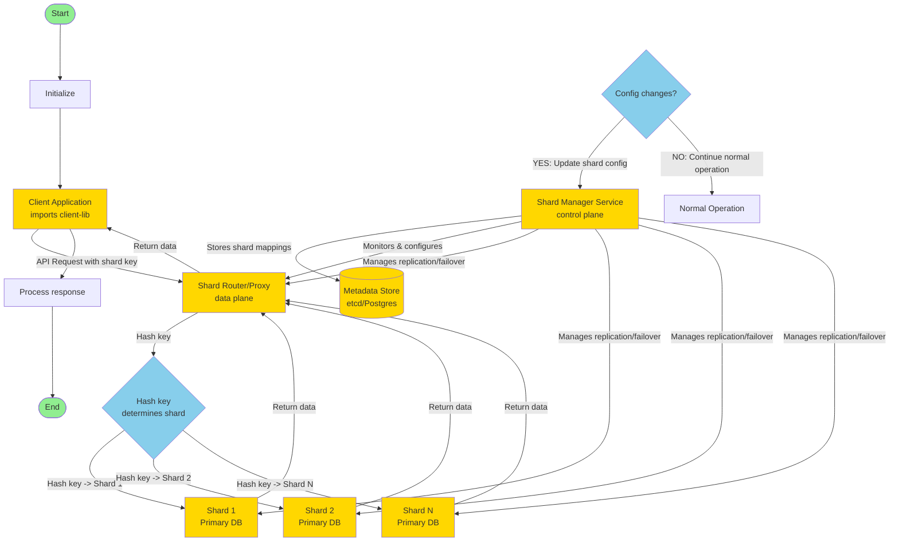
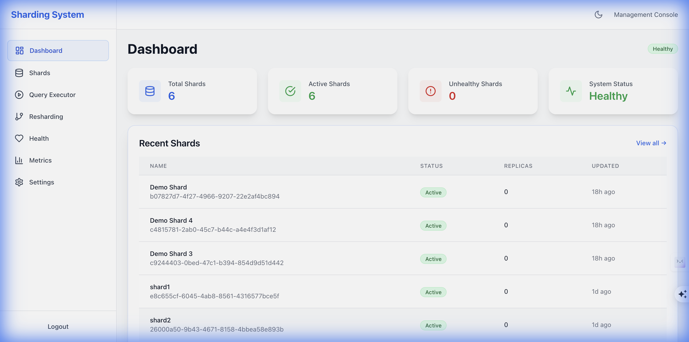
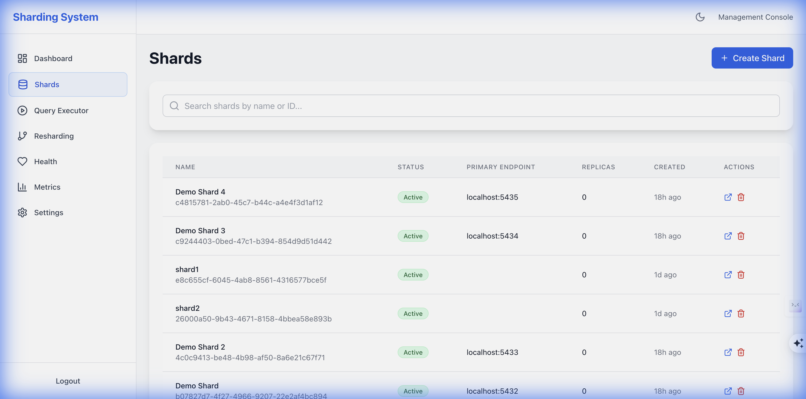
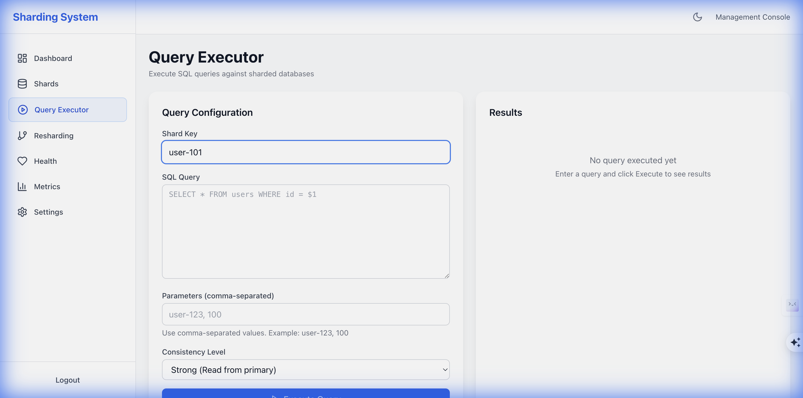

# Standalone DB Sharding Microservice

A production-ready, self-contained database sharding service that provides transparent routing, online resharding, replication management, health monitoring, and comprehensive observability.

## Architecture

The system architecture separates the **data plane** (request routing) from the **control plane** (configuration and management):



### Key Components

- **Client Application**: Entry point that uses the client library to send API requests with shard keys
- **Shard Router/Proxy (Data Plane)**: Routes requests to appropriate shards based on hash key computation
- **Shard Manager Service (Control Plane)**: Central management component that:
  - Stores shard mappings in metadata store
  - Monitors and configures the router
  - Manages replication and failover for all components
- **Metadata Store**: Stores critical system metadata (shard mappings, configurations)
- **Shard Databases**: Individual database instances holding subsets of data

## Quick Start

### Prerequisites

- Go 1.21+
- Docker & Docker Compose (for local development)
- etcd (or PostgreSQL for metadata store)
- Node.js 18+ (for UI)

### Run with Docker Compose

```bash
docker-compose up -d
```

### Initial Setup

**Important**: On first startup, you must set up your admin credentials. The system does not create default users.

```bash
# Create your admin account
curl -X POST http://localhost:8081/api/v1/auth/setup \
  -H "Content-Type: application/json" \
  -d '{
    "username": "admin",
    "password": "YourSecurePassword123!"
  }'
```

**Note**: Maximum of 2 admin users allowed. See [Setup Guide](docs/user/SETUP_GUIDE.md) for details.

The UI will be available at `http://localhost:3000`

## Developer Guide

### Building the Project
To build the project, run:
```bash
make build
```

### Running Locally
To start the entire system locally using Docker Compose:
```bash
make start-all
```
This will start the Shard Manager, Router, Etcd, and the UI.

### Running Tests
To run unit tests:
```bash
make test
```

## Client Usage

### Go Client
The Go client provides a convenient way to interact with the sharding system.

```go
package main

import (
	"fmt"
	"log"

	"github.com/sharding-system/pkg/client"
)

func main() {
	// Create a client pointing to the router
	client := client.NewClient("http://localhost:8080")

	// Get shard for a key
	shardID, err := client.GetShardForKey("user-123")
	if err != nil {
		log.Fatal(err)
	}
	fmt.Printf("Shard ID for 'user-123': %s\n", shardID)

	// Execute a query with strong consistency (reads from primary)
	result, err := client.QueryStrong(
		"user-123",
		"SELECT * FROM users WHERE id = $1",
		"user-123",
	)
	if err != nil {
		log.Fatal(err)
	}
	fmt.Printf("Query returned %d rows\n", result.RowCount)
}
```

### Java Client
The Java client can be used in your Spring Boot applications.

```java
@Service
public class UserService {

    private final ShardingClient shardingClient;

    public UserService(ShardingClient shardingClient) {
        this.shardingClient = shardingClient;
    }

    public User getUser(String userId) {
        // Route request based on userId
        Shard shard = shardingClient.getShardForKey(userId);
        
        // Execute query on the specific shard
        return shardingClient.executeQuery(
            shard,
            "SELECT * FROM users WHERE id = ?",
            userId
        );
    }
}
```

## Pricing & Benchmarks

The system is available in three tiers, each optimized for different scales.

| Feature | Free | Pro | Enterprise |
| :--- | :--- | :--- | :--- |
| **Max Shards** | 2 | 10 | Unlimited |
| **Max RPS** | 10 | 100 | Unlimited |
| **Consistency** | Eventual Only | Strong + Eventual | Strong + Eventual |
| **Support** | Community | Email | 24/7 Priority |

### Benchmarks

| Metric | Free Tier | Pro Tier | Enterprise Tier |
| :--- | :--- | :--- | :--- |
| **Write Latency (p99)** | ~50ms | ~20ms | <10ms |
| **Read Latency (p99)** | ~20ms | ~10ms | <5ms |
| **Throughput** | 10 req/sec | 100 req/sec | >10k req/sec |
| **Replication Lag** | <1s | <100ms | <10ms |

## Demo

Experience the **World Class Sharding System** in action.

### [Interactive Walkthrough](./WALKTHROUGH.md)
Follow our step-by-step **[Walkthrough Guide](./WALKTHROUGH.md)** to run the automated demo script and explore the system yourself.

### Dashboard
The new premium dashboard provides real-time insights into your sharded cluster.


### Shard Management
Visualize data distribution across your shards.


### Query Executor
Intelligent query routing in action.


## Documentation

For detailed setup instructions, API reference, and development guides, please visit the **[Documentation Index](./docs/README.md)**.

- **[Getting Started](./docs/user/USER_GUIDE.md)**
- **[Architecture](./docs/architecture/ARCHITECTURE.md)**
- **[API Reference](./docs/api/API_REFERENCE.md)**
- **[Development](./docs/dev/DEVELOPER_GUIDE.md)**

## License

Apache 2.0

See [Cost and License Info](./docs/customer/COST_AND_LICENSE_INFO.md) for details.

