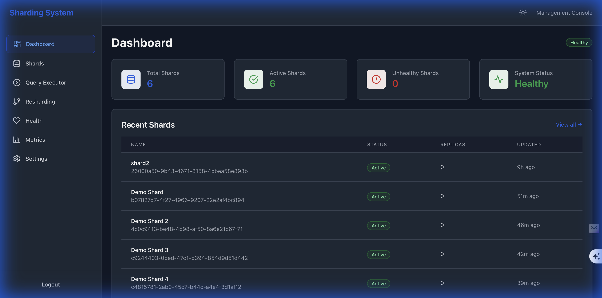
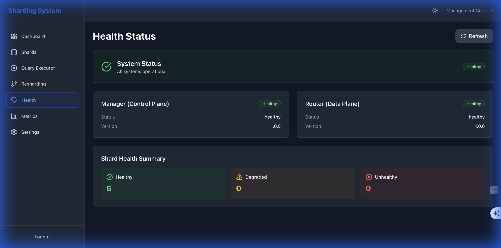
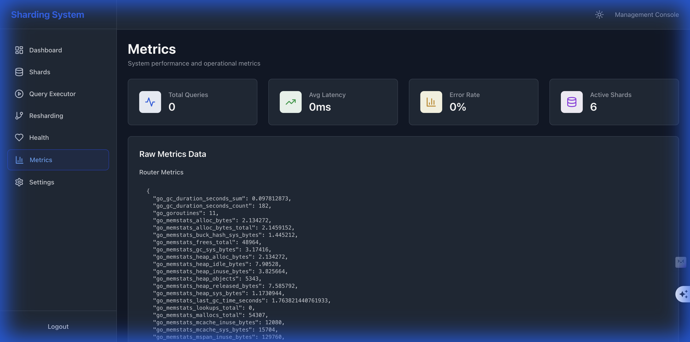
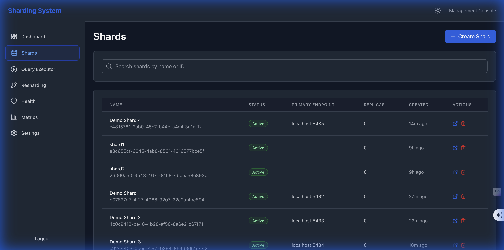

# Standalone DB Sharding Microservice

A production-ready, self-contained database sharding service that provides transparent routing, online resharding, replication management, health monitoring, and comprehensive observability.

## Architecture

```
┌─────────────────────┐
│ Client Microservice │
│  (uses client-lib)  │
└──────────┬──────────┘
           │
           ▼
┌─────────────────────┐
│  Shard Router/Proxy │
│    (data plane)     │
└──────────┬──────────┘
           │
    ┌──────┴──────┬──────────┐
    ▼             ▼          ▼
┌─────────┐  ┌─────────┐  ┌─────────┐
│ Shard 1 │  │ Shard 2 │  │ Shard N │
│ (DB)    │  │ (DB)    │  │ (DB)    │
└─────────┘  └─────────┘  └─────────┘
    │
    ▼
┌─────────────────────┐
│  Shard Manager      │
│  (control plane)    │
└──────────┬──────────┘
           │
           ▼
┌─────────────────────┐
│  Metadata Store     │
│  (etcd/Postgres)    │
└─────────────────────┘
```

## Quick Start

### Prerequisites

- Go 1.21+
- Docker & Docker Compose (for local development)
- etcd (or PostgreSQL for metadata store)
- Node.js 18+ (for UI)

### Run with Docker Compose

```bash
docker-compose up -d
```

The UI will be available at `http://localhost:3000`

## Developer Guide

### Building the Project
To build the project, run:
```bash
make build
```

### Running Locally
To start the entire system locally using Docker Compose:
```bash
make start-all
```
This will start the Shard Manager, Router, Etcd, and the UI.

### Running Tests
To run unit tests:
```bash
make test
```

## Client Usage

### Go Client
The Go client provides a convenient way to interact with the sharding system.

```go
package main

import (
	"fmt"
	"log"

	"github.com/sharding-system/pkg/client"
)

func main() {
	// Create a client pointing to the router
	client := client.NewClient("http://localhost:8080")

	// Get shard for a key
	shardID, err := client.GetShardForKey("user-123")
	if err != nil {
		log.Fatal(err)
	}
	fmt.Printf("Shard ID for 'user-123': %s\n", shardID)

	// Execute a query with strong consistency (reads from primary)
	result, err := client.QueryStrong(
		"user-123",
		"SELECT * FROM users WHERE id = $1",
		"user-123",
	)
	if err != nil {
		log.Fatal(err)
	}
	fmt.Printf("Query returned %d rows\n", result.RowCount)
}
```

### Java Client
The Java client can be used in your Spring Boot applications.

```java
@Service
public class UserService {

    private final ShardingClient shardingClient;

    public UserService(ShardingClient shardingClient) {
        this.shardingClient = shardingClient;
    }

    public User getUser(String userId) {
        // Route request based on userId
        Shard shard = shardingClient.getShardForKey(userId);
        
        // Execute query on the specific shard
        return shardingClient.executeQuery(
            shard,
            "SELECT * FROM users WHERE id = ?",
            userId
        );
    }
}
```

## Demo

Watch a quick demo of the Sharding System in action:

### Dashboard


### Health Status


### Metrics


### Shard Management


### Query Executor


## Documentation

For detailed setup instructions, API reference, and development guides, please visit the **[Documentation Index](./docs/README.md)**.

- **[Getting Started](./docs/user/USER_GUIDE.md)**
- **[Architecture](./docs/architecture/ARCHITECTURE.md)**
- **[API Reference](./docs/api/API_REFERENCE.md)**
- **[Development](./docs/dev/DEVELOPER_GUIDE.md)**

## License

MIT

