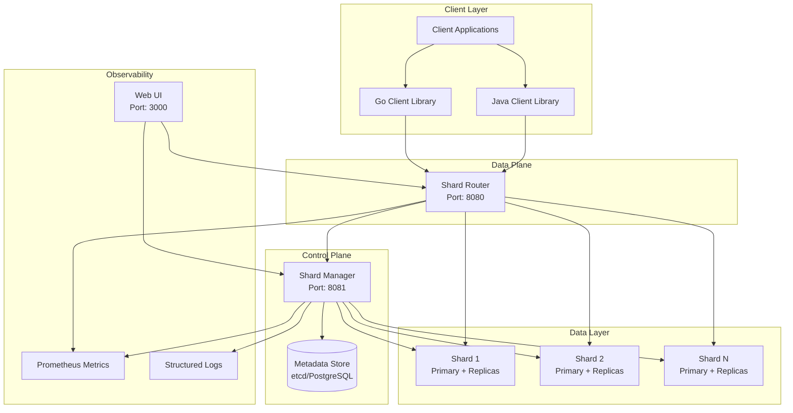
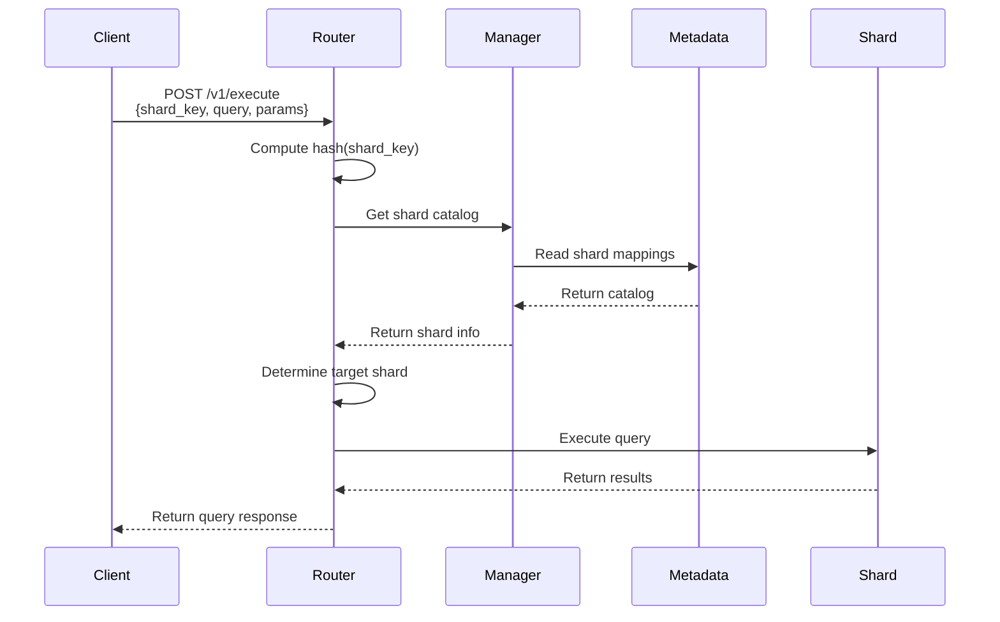
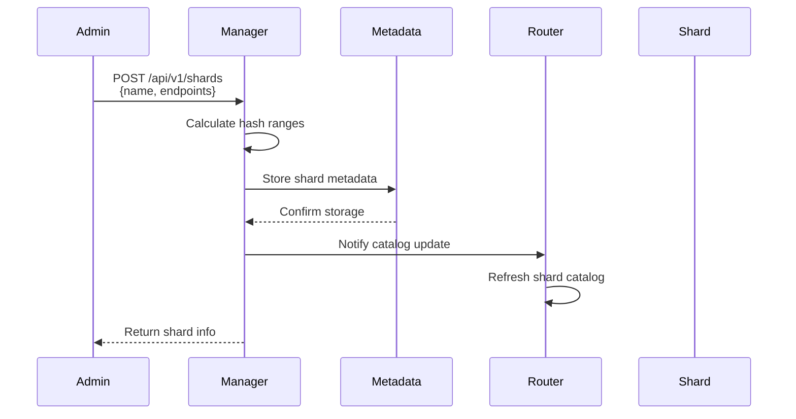

# System Architecture

## Overview

The Sharding System is a production-ready, self-contained database sharding service that provides transparent routing, online resharding, replication management, health monitoring, and comprehensive observability. The system follows a **data plane** (request routing) and **control plane** (configuration and management) separation pattern.

## High-Level Architecture

## Core Components

### 1. Shard Router (Data Plane)

The Router is the **data plane** component responsible for routing client requests to the appropriate shard.

**Responsibilities:**
- Accepts client queries with shard keys
- Computes hash values to determine target shard
- Routes queries to the correct shard database
- Handles read consistency levels (strong vs eventual)
- Aggregates results when needed
- Provides health check endpoints

**Key Features:**
- Hash-based sharding using Murmur3 algorithm
- Consistent hashing with virtual nodes (vnodes)
- Support for strong and eventual consistency
- Connection pooling and management
- Request/response metrics

**Port:** `8080` (configurable)

### 2. Shard Manager (Control Plane)

The Manager is the **control plane** component responsible for managing shard metadata and lifecycle operations.

**Responsibilities:**
- Shard creation, deletion, and configuration
- Shard catalog management (stored in metadata store)
- Online resharding operations (split and merge)
- Replica management and failover
- Health monitoring and status reporting
- Authentication and authorization (RBAC)

**Key Features:**
- RESTful API for shard management
- Asynchronous resharding jobs
- Replica promotion for failover
- Versioned shard catalog
- Audit logging

**Port:** `8081` (configurable)

### 3. Metadata Store

The metadata store maintains critical system state and configuration.

**Supported Backends:**
- **etcd**: Distributed key-value store (recommended for production)
- **PostgreSQL**: Relational database (alternative option)

**Stored Data:**
- Shard catalog (shard IDs, hash ranges, endpoints)
- Shard status and health information
- Resharding job state
- Configuration metadata
- Virtual node mappings

### 4. Shard Databases

Individual database instances that store subsets of the overall data.

**Characteristics:**
- Each shard has a primary database instance
- Optional read replicas for high availability
- Independent schema (same schema across shards)
- Hash range assignment determines data distribution

## Data Flow

### Query Execution Flow

### Shard Management Flow

## Sharding Strategy

### Hash-Based Sharding

The system uses **hash-based sharding** with **consistent hashing** to ensure even data distribution and minimize data movement during resharding.

**Algorithm:**
1. Client provides a `shard_key` (e.g., user ID)
2. Router computes `hash = Murmur3(shard_key)`
3. Hash value is mapped to a virtual node (vnode)
4. Vnode belongs to a physical shard
5. Query is routed to that shard

**Benefits:**
- Even distribution of data across shards
- Minimal data movement when adding/removing shards
- Predictable routing logic

### Virtual Nodes (VNodes)

Each physical shard is represented by multiple virtual nodes on the consistent hash ring. This ensures:
- Better load balancing
- Smoother resharding operations
- Reduced hotspots

**Default:** 256 vnodes per shard (configurable)

## Consistency Models

### Strong Consistency
- Reads from primary database
- Guarantees latest committed data
- Higher latency, lower throughput
- Use case: Critical reads requiring latest data

### Eventual Consistency
- Reads from replica databases
- May return slightly stale data
- Lower latency, higher throughput
- Use case: Read-heavy workloads, analytics

## High Availability

### Replication
- Each shard can have multiple read replicas
- Manager monitors replica health
- Automatic failover via replica promotion

### Failover Process
1. Manager detects primary shard failure
2. Selects healthy replica
3. Promotes replica to primary
4. Updates shard catalog
5. Router automatically uses new primary

## Security Architecture

### Authentication
- JWT-based authentication
- Configurable RBAC (Role-Based Access Control)
- User database for credential storage

### Authorization
- Role-based permissions
- Endpoint-level access control
- Audit logging for all operations

### Network Security
- TLS/SSL support (configurable)
- CORS configuration
- Request size limits
- Content-Type validation

## Observability

### Metrics
- Prometheus-compatible metrics endpoints
- Query latency and throughput
- Shard health metrics
- Resharding job progress
- Error rates and types

### Logging
- Structured JSON logging (zap)
- Configurable log levels
- Request/response logging
- Audit trail for security events

### Monitoring
- Health check endpoints (`/health`, `/v1/health`)
- Shard status monitoring
- Replication lag tracking
- Web UI for visualization

## Scalability Considerations

### Horizontal Scaling
- Add more shards to increase capacity
- Router and Manager can be scaled independently
- Stateless router design enables load balancing

### Performance Optimization
- Connection pooling per shard
- Local caching of shard catalog
- Efficient hash computation
- Parallel query execution across shards

## Deployment Architecture

### Local Development
- Docker Compose setup
- Single-node etcd
- All services on localhost

### Production Deployment
- Kubernetes-ready (Helm charts provided)
- High availability etcd cluster
- Separate namespaces for components
- ConfigMaps for configuration
- Service discovery via DNS

## Technology Stack

- **Language**: Go 1.21+
- **Metadata Store**: etcd or PostgreSQL
- **API**: REST (HTTP/JSON)
- **Authentication**: JWT
- **Metrics**: Prometheus
- **Logging**: Structured JSON (zap)
- **UI**: React + TypeScript
- **Containerization**: Docker
- **Orchestration**: Kubernetes (optional)

## Design Principles

1. **Separation of Concerns**: Clear separation between data plane (Router) and control plane (Manager)
2. **Stateless Design**: Router is stateless, enabling horizontal scaling
3. **Eventual Consistency**: Metadata updates propagate asynchronously
4. **Fault Tolerance**: System continues operating with partial failures
5. **Observability First**: Comprehensive metrics, logs, and tracing
6. **Security by Default**: RBAC enabled, audit logging, input validation

