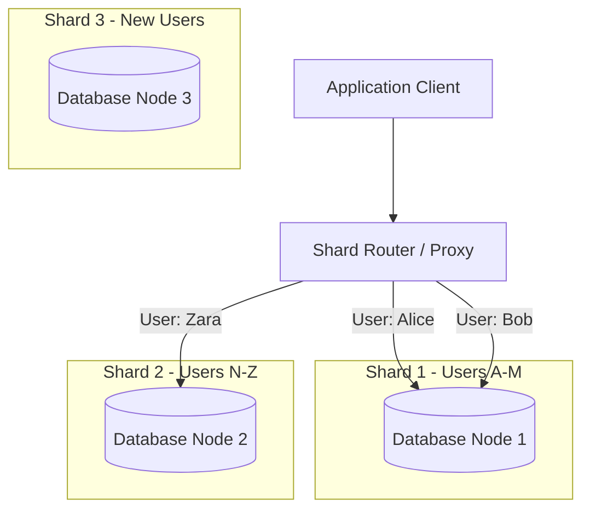
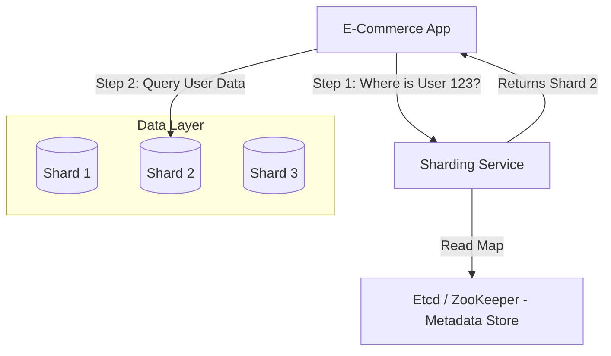

# Database Sharding: A Comprehensive Technical Guide

This guide provides a deep dive into Database Sharding, a critical architectural pattern for scaling modern large-scale systems.

---

## 1. What is Sharding?

**Database Sharding** is a method of horizontal scaling (scale-out) that involves breaking up a large database into smaller, faster, and more easily managed parts called **shards**. Each shard is a distinct database server instance that holds a subset of the overall data.

### Simple Definition
Imagine a phone book that is too heavy to carry. Instead of making the book larger (vertical scaling), you tear it into several smaller booklets: A-F, G-M, N-Z. Each booklet is a "shard." You can now distribute these booklets to different people to handle searches simultaneously.

### Technical Definition
Sharding is a **shared-nothing** architecture where data is partitioned across multiple independent database nodes. Each node has its own CPU, memory, and storage. The application or a middleware layer routes queries to the appropriate shard based on a **Shard Key**.

### Sharding vs. Replication vs. Partitioning

| Concept | Description | Key Difference |
| :--- | :--- | :--- |
| **Sharding** | Distributing data across *multiple servers*. | **Horizontal Scaling** (Write & Read scaling). |
| **Replication** | Copying the *same data* to multiple servers. | **High Availability** & **Read Scaling** (Writes go to primary). |
| **Partitioning** | Splitting a table within a *single server* (e.g., by date). | Manageability & Performance (Single node limits apply). |

### Horizontal Sharding vs. Vertical Partitioning

- **Horizontal Sharding:** Rows of a table are distributed across multiple nodes (e.g., Users 1-1M on Node A, Users 1M-2M on Node B). Schema is the same on all nodes.
- **Vertical Partitioning:** Columns of a table are split (e.g., User Profile table on Node A, User Photos table on Node B). Different schemas on different nodes.

### Visualization



---

## 2. Why Sharding is Needed

Monolithic databases eventually hit physical limits. Sharding addresses these scalability challenges.

### Challenges in Monolithic Databases
1. **Read/Write Bottlenecks:** A single CPU/Disk can only handle a finite number of IOPS.
2. **Storage Limits:** A single server has a maximum disk capacity.
3. **Connection Limits:** A single DB instance has a limit on active network connections.
4. **Single Point of Failure:** If the master node goes down, the entire write capability stops (until failover).

### Benefits of Sharding

#### 1. Performance (Query Response Times)
- **Reduced Index Size:** Smaller B-Tree indexes on each shard mean faster lookups (fewer disk hops).
- **Parallel Processing:** A query for multiple users can be executed in parallel across shards.
- **Example:** If a 1TB database is split into 4 shards of 250GB, index depth decreases, potentially improving point-lookup latency from **10ms to 2ms**.

#### 2. Scalability (Horizontal Growth)
- Linearly scale writes by adding more nodes.
- **Example:** If one node handles 5,000 writes/sec, 10 shards can theoretically handle 50,000 writes/sec.

#### 3. Fault Isolation & High Availability
- If Shard A fails, only users on Shard A are affected. Users on Shard B and C continue working normally.
- **Blast Radius Reduction:** An outage impacts only a percentage of the user base (e.g., 10% instead of 100%).

---

## 3. How Sharding Works (Technical Deep Dive)

The core mechanism of sharding is the **Shard Key** and the **Routing Logic**.

### The Shard Key
The shard key is a column (or set of columns) used to determine which shard a row belongs to. Choosing the right key is critical and immutable.
- **Good Shard Key:** High cardinality, even distribution (e.g., `user_id`, `uuid`).
- **Bad Shard Key:** Low cardinality, uneven distribution (e.g., `country` - if 90% users are from US, one shard melts down).

### Common Sharding Strategies

#### 1. Range-based Sharding
Data is partitioned based on ranges of the shard key values.
- **Logic:** `if id < 1000 -> Shard A`, `if 1000 <= id < 2000 -> Shard B`
- **Pros:** Easy to implement; range queries (`SELECT * WHERE id BETWEEN 100 AND 200`) are efficient (target single shard).
- **Cons:** **Hotspots**. If IDs are sequential (auto-increment), all new writes go to the last shard (the "hot tail" problem).

#### 2. Hash-based Sharding
A hash function is applied to the shard key to determine the shard.
- **Logic:** `Shard_ID = Hash(Key) % Number_of_Shards`
- **Pros:** Even distribution of data and load; eliminates hot tail.
- **Cons:** Resharding is expensive. Changing `Number_of_Shards` changes the modulus result for almost all keys, requiring massive data movement. **Consistent Hashing** solves this.

#### 3. Directory-based Sharding
A lookup table (service) maintains the mapping between keys and shards.
- **Logic:** `Lookup_Service.getShard(Key) -> Shard_ID`
- **Pros:** Extreme flexibility. You can move individual keys between shards without algorithmic constraints.
- **Cons:** The lookup service becomes a bottleneck and a single point of failure. Requires caching.

#### 4. Geo-based Sharding
Data is stored on shards located physically closer to the user.
- **Logic:** `Region(US) -> US_Shard`, `Region(EU) -> EU_Shard`
- **Pros:** Low latency for users; data sovereignty compliance (GDPR).
- **Cons:** Uneven distribution (US shard might be 10x bigger than AU shard).

### The Shard Router / Manager
This component sits between the application and the databases.
- **Role:** Intercepts queries, inspects the shard key, routes to the correct DB, and aggregates results if needed.
- **Examples:** `mongos` in MongoDB, Vitess VTGate, or a custom application-side library.

---

## 4. Sharding in Practice

### Relational Databases
- **MySQL/PostgreSQL:** Traditionally did not support auto-sharding. Sharding was implemented at the **Application Layer** (app knows which DB to connect to).
- **Modern Solutions:**
    - **Vitess:** A database clustering system for horizontal scaling of MySQL (used by YouTube/Slack).
    - **Citus:** An extension that transforms PostgreSQL into a distributed database.

### NoSQL Databases
- **MongoDB:** Built-in sharding. Uses a `mongos` router and Config Servers to manage metadata. Supports Range and Hash sharding.
- **Cassandra:** Uses Consistent Hashing (Ring architecture) by default. The driver knows the topology and can route requests directly to the correct node.

### Java Example: Application-Level Sharding

Here is a simple example of a Sharding Strategy interface and a Hash-based implementation.

```java
import java.util.List;
import java.util.zip.CRC32;

// 1. Define the Shard
record Shard(String id, String jdbcUrl) {}

// 2. Strategy Interface
interface ShardingStrategy {
    Shard getShard(String key, List<Shard> availableShards);
}

// 3. Hash-Based Implementation
class HashShardingStrategy implements ShardingStrategy {
    @Override
    public Shard getShard(String key, List<Shard> availableShards) {
        if (availableShards == null || availableShards.isEmpty()) {
            throw new IllegalStateException("No shards available");
        }
        
        // Use a stable hash function (CRC32 or MurmurHash)
        // Avoid String.hashCode() as it can vary or be negative
        CRC32 crc = new CRC32();
        crc.update(key.getBytes());
        long hash = crc.getValue();
        
        // Modulo arithmetic to find index
        int index = (int) (hash % availableShards.size());
        
        return availableShards.get(index);
    }
}

// 4. Usage
public class ShardingDemo {
    public static void main(String[] args) {
        List<Shard> shards = List.of(
            new Shard("shard-0", "jdbc:mysql://db0:3306/app"),
            new Shard("shard-1", "jdbc:mysql://db1:3306/app"),
            new Shard("shard-2", "jdbc:mysql://db2:3306/app")
        );

        ShardingStrategy strategy = new HashShardingStrategy();

        String userId1 = "user_12345"; // -> Goes to Shard X
        String userId2 = "user_67890"; // -> Goes to Shard Y

        System.out.println("User " + userId1 + " -> " + strategy.getShard(userId1, shards).id());
        System.out.println("User " + userId2 + " -> " + strategy.getShard(userId2, shards).id());
    }
}
```

---

## 5. Shard Rebalancing and Scaling

The hardest part of sharding is changing the number of shards after data is already populated.

### Challenges
1. **Adding Shards:** In simple hash sharding (`hash % n`), changing `n` to `n+1` invalidates the mapping for most keys.
2. **Data Migration:** Moving terabytes of data from Shard A to Shard B without downtime is complex.
3. **Hotspots:** A celebrity user (e.g., Justin Bieber on Twitter) might generate 1000x more reads/writes than average, melting down their specific shard.

### Solutions

#### Consistent Hashing
Instead of `hash % n`, map both Shards and Keys to a circular space (e.g., 0 to 2^32).
- A key belongs to the first Shard found moving clockwise on the ring.
- **Benefit:** Adding a node only requires moving keys from its immediate neighbor. Only `1/n` keys need to be remapped.

#### Virtual Nodes (VNodes)
To avoid uneven distribution in consistent hashing, each physical server is mapped to multiple points on the ring (e.g., 100 virtual nodes). This ensures better load balancing.

#### Resharding Pipelines (Online Migration)
To move data without downtime:
1. **Dual Write:** Application writes to both Old Shard and New Shard.
2. **Backfill:** A background process copies historical data from Old to New.
3. **Validation:** Verify data consistency.
4. **Cutover:** Switch reads to New Shard.
5. **Cleanup:** Stop writing to Old Shard and delete data.

---

## 6. Pros and Cons

| Feature | Advantages | Disadvantages |
| :--- | :--- | :--- |
| **Scalability** | Theoretically infinite horizontal scaling. | High complexity in infrastructure and deployment. |
| **Performance** | Faster queries due to smaller datasets per node. | **Cross-shard queries** are slow and complex (scatter-gather). |
| **Availability** | Fault isolation (partial outages). | Complex failover logic. |
| **Cost** | Can use cheaper commodity hardware. | Higher operational cost (more servers to manage). |
| **Data Integrity** | | **No Cross-Shard ACID Transactions.** Distributed transactions (2PC) are slow and often avoided. |
| **Operations** | | Backups are harder (must coordinate consistent snapshots across shards). |

### Mitigation Patterns
- **Query Router:** Middleware to handle scatter-gather queries transparently.
- **Global Secondary Indexes:** A separate service (e.g., Elasticsearch) to index fields that aren't the shard key, allowing you to find `User(email="...")` without querying all shards.

---

## 7. System Design Example: Sharding Microservice

Let's design a dedicated **Sharding Service** that other microservices consult to know where to route data.

### Requirements
- **Dynamic Allocation:** Register new shards via API.
- **Routing:** Provide `getShard(key)` endpoint.
- **High Availability:** The service itself must be replicated.

### Architecture Diagram



### Data Flow
1. **Config:** Admin posts new shard config to Sharding Service. Service updates Etcd.
2. **Discovery:** Application starts up, polls Sharding Service for the current "Shard Map" and caches it locally (Smart Client).
3. **Routing:** Application uses local map to route queries directly to DBs.

### Database Schema (Metadata)
The Sharding Service needs a simple schema to track shards:

```sql
CREATE TABLE shard_metadata (
    shard_id INT PRIMARY KEY,
    jdbc_url VARCHAR(255),
    status VARCHAR(20), -- ACTIVE, DRAINING, OFFLINE
    range_start BIGINT, -- For range sharding
    range_end BIGINT
);
```

---

## 8. Real-World Use Cases

### Netflix
- **Use Case:** Storing billions of viewing history records.
- **Strategy:** Cassandra (Consistent Hashing).
- **Benefit:** Linear write scalability. As they gained users, they simply added more Cassandra nodes.

### Twitter (Snowflake ID)
- **Use Case:** Storing Tweets.
- **Strategy:** Custom ID generation (**Snowflake**) where the ID itself contains the timestamp and machine ID.
- **Sharding:** Originally sharded by User ID.
- **Problem:** "Justin Bieber" problem. If sharded by User ID, retrieving a user's timeline is fast, but writing to a celebrity's timeline (fan replies) creates a hotspot.
- **Evolution:** Sharding strategy evolved to optimize for "Home Timeline" reads vs "User Timeline" writes.

### Amazon
- **Use Case:** Product Catalog and Orders.
- **Strategy:** DynamoDB (Managed Sharding).
- **Benefit:** Amazon DynamoDB handles partitioning automatically. Developers just choose a Partition Key.

---

## 9. Best Practices & Recommendations

1. **Choose the Right Shard Key:** This is the most irreversible decision.
    - Avoid keys that increase monotonically (timestamps) if using Range Sharding.
    - Choose keys that partition data evenly.
2. **Avoid Cross-Shard Joins:** Design your schema so that all data required for a common transaction lives on the same shard (Data Locality).
    - *Example:* Store `Orders` on the same shard as the `User` who made them.
3. **Handle Failures Gracefully:** Your app must handle the case where Shard 5 is down but Shard 1-4 are up. Show partial data or a friendly error.
4. **Monitoring:** Monitor "Data Skew" (is one shard getting full?) and "Request Skew" (is one shard getting all the traffic?).

---

## 10. Conclusion

Sharding is a powerful tool for achieving **hyperscale**, but it introduces significant **operational complexity**.

### Decision Matrix: Should you Shard?

| Scenario | Recommendation |
| :--- | :--- |
| **Data < 1 TB** | **NO.** Use Read Replicas and caching (Redis). |
| **Write Heavy (> 10k writes/sec)** | **YES.** Single master cannot handle the IOPS. |
| **Complex Joins Required** | **NO.** Sharding breaks joins. Consider a larger vertical instance. |
| **Global User Base** | **YES.** Geo-sharding for latency compliance. |

**Final Thought:** Start with a monolith. Optimize queries. Add indexes. Add caching. Add read replicas. Only when you have exhausted all these options should you implement sharding.
